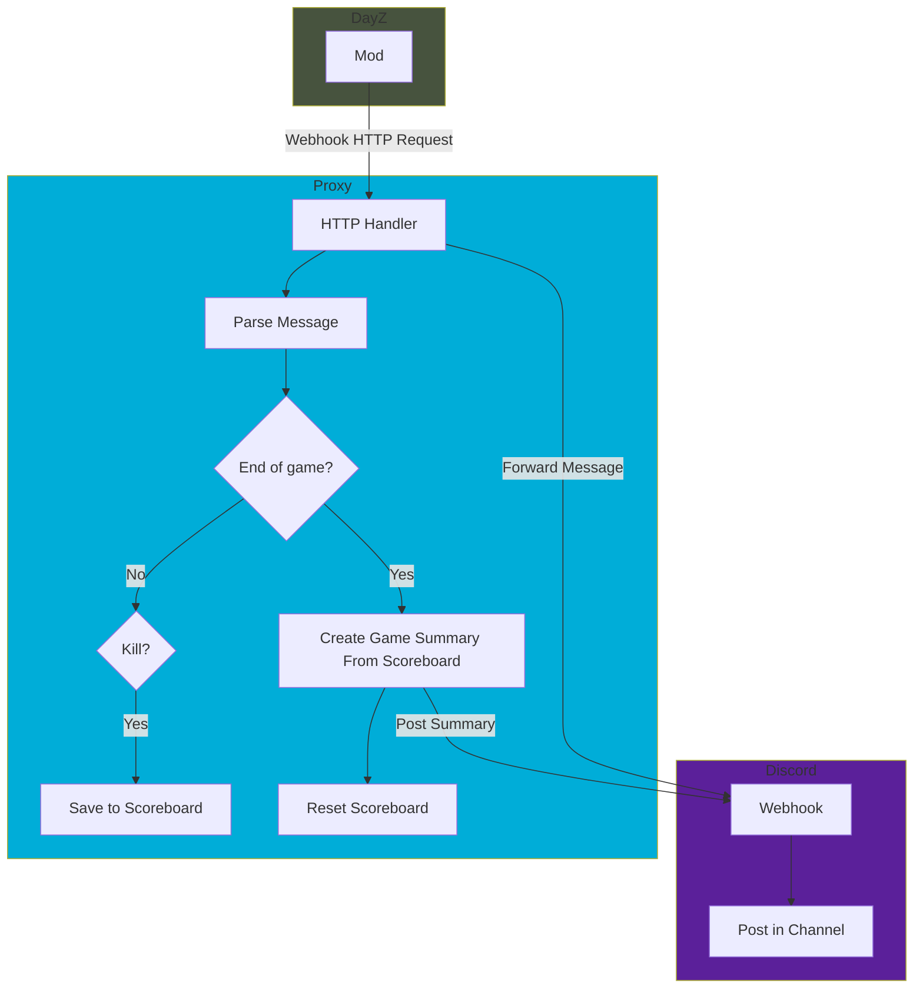

[](https://pkg.go.dev/github.com/jmhobbs/dayz-crimson-zamboni-deathmatch-webhook-proxy)
[](https://github.com/jmhobbs/dayz-crimson-zamboni-deathmatch-webhook-proxy/actions/workflows/golangci-lint.yml)
[](https://github.com/jmhobbs/dayz-crimson-zamboni-deathmatch-webhook-proxy/actions/workflows/test.yml)
[](https://codecov.io/gh/jmhobbs/dayz-crimson-zamboni-deathmatch-webhook-proxy)

# Crimson Zamboni Deathmatch Webhook Proxy

The [Crimson Zamboni Deathmatch](https://crimsonzamboni.com/deathmatch.html) for DayZ provides a webhook for Discord.

This proxy server sits in between the game and Discord, allowing you to track events and customize posts to Discord.

Currently, it only sends a message showing the longest kill at the end of a match, but it could be used to track and post other scoreboard type stats as well.



## Configuration

Configuration can be done via flags, environment variables, or a config file.

| Flag              | Environment Variable | Config Key       | Description                                                           | Default |
|-------------------|----------------------|------------------|-----------------------------------------------------------------------|---------|
| -config           | CONFIG               | N/A              | Config file to load                                                   | (none)  |
| -debug            | DEBUG                | debug            | Log debug info                                                        | false   |
| -listen           | LISTEN               | listen           | Interface and port to listen on                                       | :8080   |
| -webhook-url      | WEBHOOK_URL          | webhook-url      | Discord webhook URL to forward messages to                            | (none)  |
| -summary-template | SUMMARY_TEMPLATE     | summary-template | Template for the summary message sent at the end of a game (optional) | (none)  |

At a minimum, `-webhook-url` must be set, and should be the Discord webhook URL you wish to post messages to.

### Config File

The format of the config file is plain text, and very simple: `<key><whitespace><value>`

e.g.

```
webhook_url https://discord.com/api/webhooks/...
lsiten :8081
```

### Summary Template

The summary template is a [Go text/template](https://pkg.go.dev/text/template) that is used to create the message sent to Discord at the end of a game.

The `.` object passed to the template is a `Scoreboard` object from `pkg/http/interfaces.go`

The default template is in `cmd/proxy/summary.tmpl`

There is a command provided for testing your templates in `cmd/template-check`
